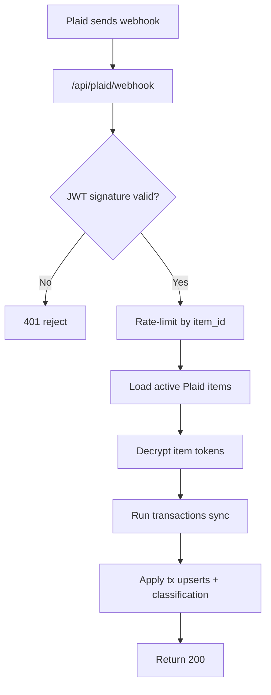
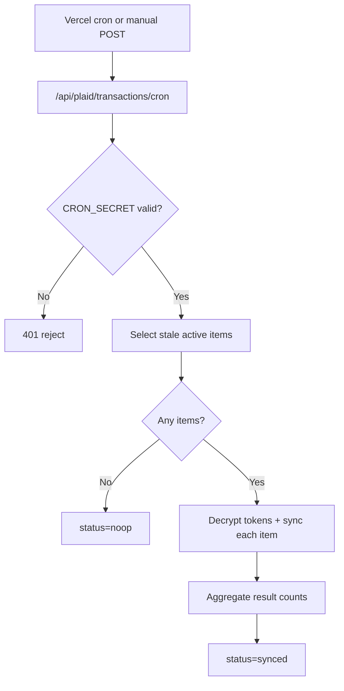
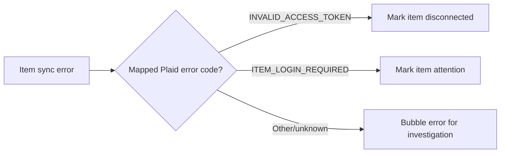

# Plaid Sync Workflows

## Webhook-Triggered Sync

```mermaid
flowchart TD
  A["Plaid sends webhook"] --> B["/api/plaid/webhook"]
  B --> C{"JWT signature valid?"}
  C -- "No" --> D["401 reject"]
  C -- "Yes" --> E["Rate-limit by item_id"]
  E --> F["Load active Plaid items"]
  F --> G["Decrypt item tokens"]
  G --> H["Run transactions sync"]
  H --> I["Apply tx upserts + classification"]
  I --> J["Return 200"]
```

## Cron Fallback Sync

```mermaid
flowchart TD
  A["Vercel cron or manual POST"] --> B["/api/plaid/transactions/cron"]
  B --> C{"CRON_SECRET valid?"}
  C -- "No" --> D["401 reject"]
  C -- "Yes" --> E["Select stale active items"]
  E --> F{"Any items?"}
  F -- "No" --> G["status=noop"]
  F -- "Yes" --> H["Decrypt tokens + sync each item"]
  H --> I["Aggregate result counts"]
  I --> J["status=synced"]
```

## Failure Isolation Behavior

```mermaid
flowchart LR
  A["Item sync error"] --> B{"Mapped Plaid error code?"}
  B -- "INVALID_ACCESS_TOKEN" --> C["Mark item disconnected"]
  B -- "ITEM_LOGIN_REQUIRED" --> D["Mark item attention"]
  B -- "Other/unknown" --> E["Bubble error for investigation"]
```

This prevents one invalid Plaid item from crashing the entire sync batch.
