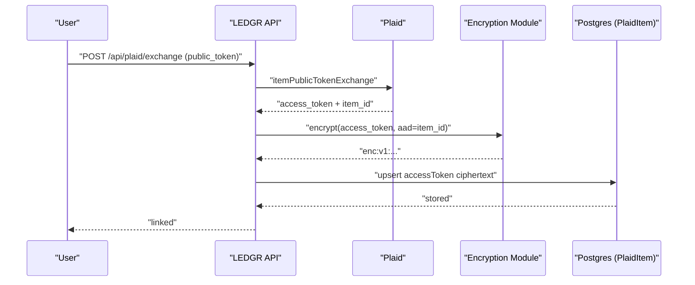
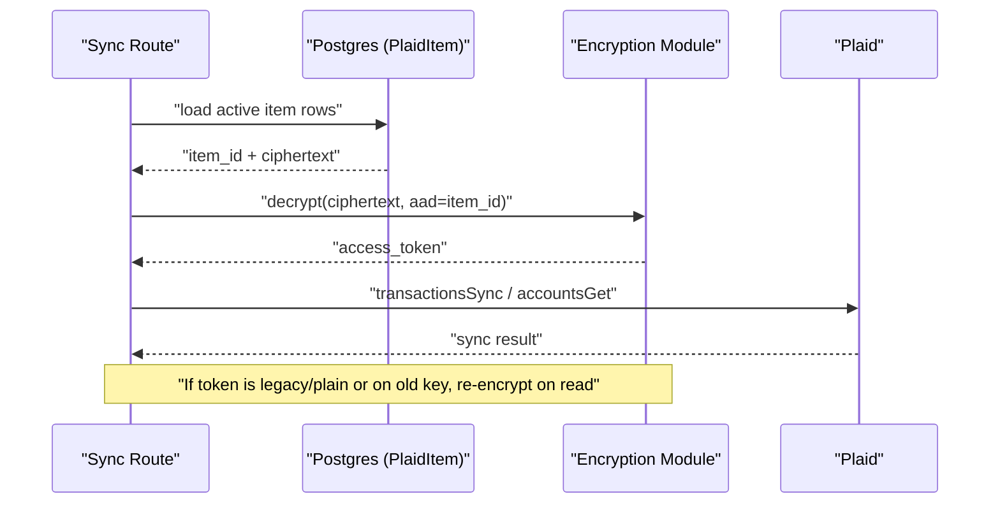

# Plaid Token Encryption Flow

## Rotation Model

- `PLAID_TOKEN_ENCRYPTION_KEYS` supports multiple versioned keys.
- `PLAID_TOKEN_ENCRYPTION_PRIMARY_KEY_ID` selects write key.
- Reads can decrypt with old keys and lazily re-encrypt to primary.
