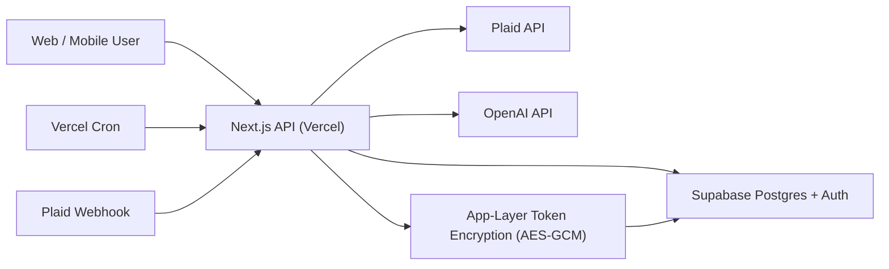

# LEDGR System Overview

## Notes

- The API runtime on Vercel is the trust boundary that handles encryption/decryption.
- Supabase stores encrypted Plaid token ciphertext for active linked items.
- Plaid webhooks and scheduled cron both feed transaction sync.
