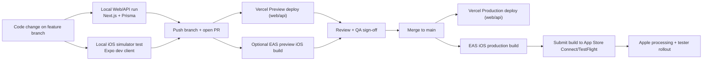
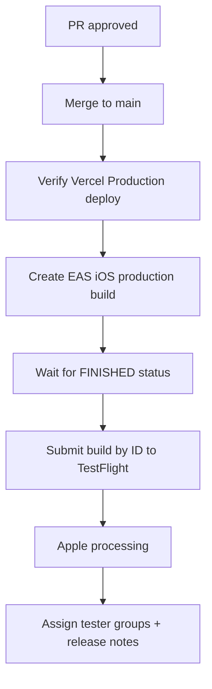

# LEDGR Development and Release Pipeline

This is the canonical onboarding/runbook for engineering workflow across local development, lower environments, and production iOS releases.

## 1) Pipeline Overview



## 2) Current CI/CD Reality

- GitHub Actions currently handle feedback triage/autofix workflows only.
- There is no full test/build gate for web/mobile deployment yet.
- Web/API deployment is handled by Vercel (Preview + Production) from Git integration.
- iOS binaries are built and submitted via EAS.

## 3) Environment Matrix

| Layer | Local Dev | Lower Env (Preview) | Production |
|---|---|---|---|
| Web/API runtime | `npm run dev` | Vercel Preview | Vercel Production |
| Mobile backend target | local/preview URL via `EXPO_PUBLIC_API_BASE_URL` | preview backend URL | production backend URL |
| EAS environment | `development` | `preview` | `production` |
| EAS build profile | `development` | `preview` | `production` |
| iOS distribution | simulator/dev client | internal distribution | App Store Connect/TestFlight |

## 4) One-Time Machine Setup

### Prerequisites

- Node.js 20+
- npm
- Xcode + iOS Simulator (for local iOS testing)
- Expo/EAS access (Expo account with project permissions)
- App Store Connect credentials already configured in Expo project

### Install dependencies

```bash
cd /Users/brandennevius/Desktop/LEDGR
npm install

cd /Users/brandennevius/Desktop/LEDGR/apps/mobile
npm install
```

## 5) Local Development Workflow (Feature Work)

### Start feature branch

```bash
cd /Users/brandennevius/Desktop/LEDGR
git checkout main
git pull
git checkout -b codex/<feature-name>
```

### Run web/API locally

```bash
cd /Users/brandennevius/Desktop/LEDGR
npm run dev
```

### Run mobile in iOS simulator

First time (or after native dependency/config changes):

```bash
cd /Users/brandennevius/Desktop/LEDGR/apps/mobile
npx expo run:ios
```

Then run Metro for day-to-day iteration:

```bash
cd /Users/brandennevius/Desktop/LEDGR/apps/mobile
npx expo start --dev-client
```

### Local validation commands before PR

```bash
cd /Users/brandennevius/Desktop/LEDGR
npm run lint
npx tsc --noEmit

cd /Users/brandennevius/Desktop/LEDGR/apps/mobile
npx tsc --noEmit
```

### Commit and push feature branch

```bash
cd /Users/brandennevius/Desktop/LEDGR
git add <files>
git commit -m "<summary>"
git push -u origin codex/<feature-name>
```

## 6) Lower Environment QA Flow

### Web/API preview

- Open PR from `codex/<feature-name>` into `main`.
- Confirm Vercel Preview deployment is healthy.
- Validate API and app behavior against preview environment variables.

### Optional preview iOS build for internal QA

```bash
cd /Users/brandennevius/Desktop/LEDGR/apps/mobile
npx eas-cli build -p ios --profile preview
```

## 7) Promotion to Production



### Merge to main

```bash
cd /Users/brandennevius/Desktop/LEDGR
git checkout main
git pull
git merge --ff-only codex/<feature-name>
git push origin main
```

### Build iOS production binary

```bash
cd /Users/brandennevius/Desktop/LEDGR/apps/mobile
npx eas-cli build -p ios --profile production --non-interactive
```

Capture the build ID from EAS output. Example:

```bash
npx eas-cli build:view <build-id> --json
```

### Submit exact build to TestFlight

```bash
cd /Users/brandennevius/Desktop/LEDGR/apps/mobile
npx eas-cli submit -p ios --id <build-id> --profile production --non-interactive --wait
```

### Verify in App Store Connect

- Go to TestFlight in App Store Connect.
- Wait for Apple processing to complete.
- Add the build to tester groups.
- Publish release notes/what-to-test.

## 8) Database Migration Flow (When Schema Changes)

### Create migration in local/dev

```bash
cd /Users/brandennevius/Desktop/LEDGR
npx prisma migrate dev --name <migration-name>
```

Commit the generated migration folder in `/Users/brandennevius/Desktop/LEDGR/prisma/migrations`.

### Apply migrations in production

Run production migration deployment from a secure environment with production `DATABASE_URL`:

```bash
cd /Users/brandennevius/Desktop/LEDGR
npx prisma migrate deploy
```

Do this before or alongside production feature rollout when schema changes are required.

## 9) Secrets and Environment Ownership

- Do not store production secrets in repo files.
- Vercel is source of truth for web/API environment variables by scope:
  - Development
  - Preview
  - Production
- Expo EAS Environments are source of truth for mobile build-time variables:
  - `development`
  - `preview`
  - `production`
- Keep variable names identical across environments; only values should differ.

## 10) Hotfix Workflow

- Branch from `main`: `codex/hotfix-<name>`
- Apply minimal fix + validate on simulator.
- Merge to `main`.
- Trigger new production iOS build + submit with a new build number.
- Do not reuse previous TestFlight binaries.

## 11) Quick Command Reference

```bash
# Web/API local
cd /Users/brandennevius/Desktop/LEDGR
npm run dev

# Mobile simulator (first-time native run)
cd /Users/brandennevius/Desktop/LEDGR/apps/mobile
npx expo run:ios

# Mobile dev client
cd /Users/brandennevius/Desktop/LEDGR/apps/mobile
npx expo start --dev-client

# iOS preview build
cd /Users/brandennevius/Desktop/LEDGR/apps/mobile
npx eas-cli build -p ios --profile preview

# iOS production build
cd /Users/brandennevius/Desktop/LEDGR/apps/mobile
npx eas-cli build -p ios --profile production --non-interactive

# Submit exact production build to TestFlight
cd /Users/brandennevius/Desktop/LEDGR/apps/mobile
npx eas-cli submit -p ios --id <build-id> --profile production --non-interactive --wait
```
